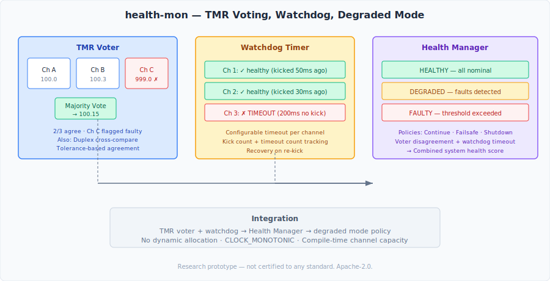

# health-mon

System health monitoring with TMR voting, watchdog timers, and degraded mode management for avionics research.

## What This Is

`health-mon` provides redundancy management and fault detection:

- **TMR Voter** — Triple modular redundancy majority voter. Compares three independent channels, outputs the majority value, identifies the dissenting channel
- **Duplex Voter** — Dual-channel cross-comparator for simpler redundancy schemes
- **Watchdog Timer** — Multi-channel heartbeat monitoring with configurable timeouts and fault counting
- **Health Manager** — Integrated system health assessment combining voter disagreement rates and watchdog timeouts with degraded mode policies (continue, failsafe, shutdown)

This is how safety-critical systems handle the inevitable: components fail, sensors disagree, heartbeats stop.

## Architecture



```
include/health/
├── types.hpp                    # Status, RedundancyMode, Timestamp
├── voter/
│   └── tmr_voter.hpp           # TMR majority voter + duplex cross-comparator
├── watchdog/
│   └── watchdog.hpp            # Multi-channel watchdog timer with timeout detection
└── manager/
    └── health_manager.hpp      # Integrated health assessment + degraded mode policies
```

## Quick Start

```bash
mkdir build && cd build
cmake .. -DCMAKE_BUILD_TYPE=Release
cmake --build . -j$(nproc)

# Run tests
./test_health
```

## TMR Voting

Three channels provide redundant readings. The voter determines the output:

```
Channel A: 100.0  ┐
Channel B: 100.3  ├─→ TMR Vote → 100.1 (all agree, 3/3)
Channel C:  99.8  ┘

Channel A: 100.0  ┐
Channel B: 100.3  ├─→ TMR Vote → 100.15 (2 agree, channel C faulty)
Channel C: 999.0  ┘

Channel A:  10.0  ┐
Channel B:  50.0  ├─→ TMR Vote → 50.0 (no agreement, output median)
Channel C:  90.0  ┘
```

## Degraded Mode Management

The health manager tracks cumulative faults and applies a policy:

| System State | Condition | Policies Available |
|-------------|-----------|-------------------|
| Healthy | No timeouts, <5% voter disagreement | Continue normally |
| Degraded | Some timeouts or voter disagreements | Continue / Failsafe |
| Faulty | Fault count exceeds threshold | Continue / Failsafe / Shutdown |

## Test Results

| Test | Result | Notes |
|------|--------|-------|
| TMR all agree | ✅ | 3/3 agreement, averaged output |
| TMR one faulty | ✅ | 2/3 agreement, faulty channel identified |
| TMR no agreement | ✅ | Median output, all flagged |
| Watchdog timeout | ✅ | Timeout detection + recovery on re-kick |
| Duplex cross-compare | ✅ | Agreement/disagreement thresholds |
| Health manager integration | ✅ | Healthy → Degraded → Faulty → shutdown |

> **Note:** Results are reproducible under controlled conditions but may vary across platforms.

## Design Constraints

- C++23, CMake ≥ 3.25
- `-Wall -Wextra -Wpedantic -Werror`
- Header-only (no separate compilation)
- No dynamic allocation — all channels and entries fixed at compile time
- `CLOCK_MONOTONIC` for watchdog timestamps
- Deterministic: same inputs → same health assessment

## Dependencies

None. Pure C++23 standard library.

## Portfolio Context

`health-mon` is part of the [avionics-lab](https://github.com/yablokolabs/avionics-lab) research portfolio:

| Repository | Role |
|-----------|------|
| [partition-guard](https://github.com/yablokolabs/partition-guard) | Time/space isolation |
| [comm-bus](https://github.com/yablokolabs/comm-bus) | Deterministic data bus |
| [wcet-probe](https://github.com/yablokolabs/wcet-probe) | Execution timing characterization |
| [virt-jitter-lab](https://github.com/yablokolabs/virt-jitter-lab) | Virtualization latency measurement |
| [track-core](https://github.com/yablokolabs/track-core) | Probabilistic state estimation |
| [detframe](https://github.com/yablokolabs/detframe) | Deterministic rendering |
| [nav-sim](https://github.com/yablokolabs/nav-sim) | Flight phase + mode management |
| [log-replay](https://github.com/yablokolabs/log-replay) | Flight data recording + replay |
| **health-mon** | **TMR voting + health monitoring** |
| [fault-inject](https://github.com/yablokolabs/fault-inject) | Fault injection + resilience testing |

## License

Apache-2.0. See [LICENSE](LICENSE).
